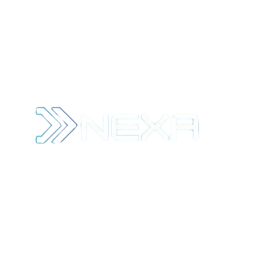

# 🚀 Nexa OS — Personal AI Work OS

<p align="center">
  
</p>

<p align="center">
  <strong>Transformez vos idées brutes en projets structurés, planifiés et exécutables, dans le respect strict de votre énergie.</strong>
</p>

<p align="center">
  
  
  
  
  
  
</p>

---

## 📖 Sommaire

1. [Présentation](#-présentation)
2. [Fonctionnalités Clés](#-fonctionnalités-clés)
3. [Architecture & Stack Technique](#-architecture--stack-technique)
4. [Assistant IA & Flexibilité Conversationnelle](#-assistant-ia--flexibilité-conversationnelle)
5. [Support PWA & Installation](#-support-pwa--installation)
6. [Intégration Supabase Cloud](#-intégration-supabase-cloud)
7. [Installation & Démarrage](#-installation--démarrage)
8. [Variables d'Environnement](#-variables-denvironnement)
9. [Structure du Projet](#-structure-du-projet)

---

## 🎯 Présentation

**Nexa OS** est un système d'exploitation de travail personnel ("Personal Work OS") pensé pour les solopreneurs, créateurs et développeurs indépendants.

Contrairement aux outils traditionnels (Jira, Linear, Trello) qui exigent un paramétrage manuel chronophage et ignorent la physiologie humaine, **Nexa OS** :
- Décompose n'importe quelle idée textuelle en une roadmap complète grâce à l'IA.
- Planifie automatiquement les sessions de travail dans votre agenda en respectant vos pics d'énergie circadiens et vos temps de repos.
- Propose une **Session Focus** plein écran pour exécuter sans distraction.
- Agit comme un **co-équipier IA interactif** qui dialogue, pose des questions, analyse les retards et vous conseille.

---

## ✨ Fonctionnalités Clés

- **🤖 Architecte de Projet IA Multi-Provider** :
  - Support de 4 grands fournisseurs d'IA au choix : **OpenAI (GPT-4o)**, **Google Gemini**, **Anthropic Claude**, et **DeepSeek**.
  - Décomposition automatique en phases et micro-tâches concrètes (15 min à 2h max).
  - Détection des dépendances techniques, failles potentielles et informations manquantes.
  - Mode démo interactif sans clé API pour tester immédiatement.

- **💬 Assistant IA Conversationnel ("Nexa Kernel")** :
  - Dialogue continu avec contexte complet du projet.
  - Pose des questions ciblées si le projet est flou.
  - Fait des remarques constructives et des suggestions d'architecture / MVP.
  - Surveille l'avancement : détecte si des tâches prennent plus de temps que prévu et propose des ajustements.
  - Recommande des agents IA spécialisés (*Cursor, Claude Code, GitHub Copilot, v0.dev, Bolt.new*) ou des pairs développeurs pour les parties complexes.

- **📅 Moteur de Planification Circadien Adaptatif** :
  - Placement intelligent des blocs de travail selon les créneaux réels de disponibilité.
  - Priorisation des tâches exigeantes ("deep work") pendant le pic d'énergie matinal.
  - Respect strict des pauses déjeuner, des week-ends et du repos quotidien.

- **🎯 Session Focus Immersive** :
  - Mode d'exécution plein écran sans distraction.
  - Minuteur intelligent, prise de notes rapide d'idées spontanées et bilan d'estimation de fin de session.

- **📱 Progressive Web App (PWA)** :
  - Installable en 1 clic sur PC (bouton dédié dans le Header, compatible Chrome/Edge/Brave) et sur smartphone (iOS Safari / Android).
  - Notifications in-app et notifications système du navigateur.
  - Support hors-ligne complet via Service Worker et mise en cache Workbox.

- **☁️ Supabase Cloud & OAuth Google** :
  - Authentification Email/Mot de passe ou **Connexion Google en un clic**.
  - Synchronisation automatique des données dans PostgreSQL avec sécurité Row Level Security (RLS).
  - Upload et hébergement des photos de profil dans le bucket Supabase Storage `avatars`.

---

## 🛠 Architecture & Stack Technique

| Domaine | Technologies |
| :--- | :--- |
| **Frontend Framework** | React 18 (Hooks, Suspense, ErrorBoundary) |
| **Langage & Typage** | TypeScript (Typage strict complet) |
| **Bundler & PWA** | Vite 8 + `vite-plugin-pwa` (Workbox Service Worker) |
| **Styling & Design** | Tailwind CSS v3 + Design System personnalisé ("Luminous Focus") |
| **Typographie** | *Plus Jakarta Sans* (textes & titres) + *JetBrains Mono* (code & métriques) |
| **Icônes** | Google Material Symbols Outlined |
| **Gestion d'État** | Zustand (avec persistance locale & synchronisation cloud Supabase) |
| **Backend as a Service** | Supabase (PostgreSQL 15, GoTrue Auth, Storage S3-compatible, RLS) |
| **Providers IA** | OpenAI API, Google Generative AI, Anthropic Messages API, DeepSeek Chat |

---

## 🧠 Assistant IA & Flexibilité Conversationnelle

L'assistant **Nexa Kernel** intégré dans les détails de chaque projet respecte un ensemble de principes stricts définis dans `src/lib/aiService.ts` :

1. **Clarification proactive** : Si la description initiale ou une tâche est vague, l'assistant pose des questions ciblées pour préciser le périmètre.
2. **Critiques & Corrections bienveillantes** : L'IA met en garde contre la sur-ingénierie et propose des alternatives plus directes (philosophie Lean MVP).
3. **Analyse des écarts de temps** : Le store injecte les données réelles (`actualMinutes` vs `estimatedMinutes`). Si des tâches prennent plus de temps que prévu, l'IA demande comment s'est déroulée la tâche et propose d'adapter les échéances.
4. **Conseil d'outils et d'experts** :
   - *Code & Refactor* : Recommande **Cursor**, **Devin**, **Claude Code** ou **GitHub Copilot**.
   - *Design & Frontend* : Recommande **v0.dev**, **Tailwind UI** ou **Bolt.new**.
   - *Documentation & Recherche* : Recommande **Perplexity AI**.
   - *Briques très pointues* : Suggère de solliciter un ami développeur ou de déléguer à un freelance.

---

## 📲 Support PWA & Installation

L'application est une **PWA installable** conforme aux standards du web moderne :

- **Sur PC / Ordinateur** :
  - Un bouton bleu **`[ 🖥️↓ Installer ]`** est présent dans la barre d'en-tête (Header).
  - Un clic déclenche l'installation native Chrome / Edge ou ouvre le guide interactif si le navigateur ne supporte pas l'API standard.
- **Sur Mobile (Android / iOS)** :
  - Un bandeau discret apparaît pour proposer l'installation sur l'écran d'accueil.
  - Un guide étape par étape est disponible pour Safari iOS (*Partager → Sur l'écran d'accueil*).
- **Notifications** :
  - Notification automatique dans le panneau de notifications de Nexa OS.
  - Notification native du système via l'API Web Notification.

---

## 🔒 Intégration Supabase Cloud

Le fichier `supabase-schema.sql` contient la structure complète de la base de données :
- Tables : `profiles`, `work_preferences`, `projects`, `work_sessions`, `blocked_periods`, `user_stats`.
- Sécurité RLS : chaque utilisateur ne peut lire et modifier que ses propres enregistrements (`auth.uid() = user_id`).
- Bucket Storage `avatars` : pour le stockage des photos de profil personnalisées.
- Trigger SQL automatique : création automatique du profil utilisateur dès l'inscription ou la connexion Google.

---

## 🚀 Installation & Démarrage

### Prérequis
- **Node.js** (v18+)
- **npm** (v9+)

### 1. Cloner et installer les dépendances
```bash
git clone https://github.com/votre-compte/nexa-os.git
cd nexa-os
npm install
```

### 2. Configurer les variables d'environnement
Créez un fichier `.env` à la racine de `nexa-os` :
```env
VITE_SUPABASE_URL=https://votre-projet.supabase.co
VITE_SUPABASE_ANON_KEY=votre-cle-anon-publique
```

### 3. Lancer le serveur de développement
```bash
npm run dev
```
L'application démarre immédiatement sur `http://localhost:5173`.

### 4. Compiler pour la production (avec PWA & Service Worker)
```bash
npm run build
npm run preview
```

---

## 📁 Structure du Projet

```text
nexa-os/
├── public/
│   ├── nexa.jpg             # Favicon & icône application
│   ├── nexawbg.png          # Logo officiel haute résolution (fond transparent)
│   └── favicon.svg          # Favicon vectoriel de secours
├── src/
│   ├── components/
│   │   ├── auth/            # Pages de connexion, inscription et OAuth Google
│   │   ├── layout/          # AppShell, Sidebar, Header avec bouton PWA
│   │   ├── ui/              # Toast, Modal, ErrorBoundary, NotificationPanel
│   │   └── PWAInstallPrompt.tsx # Gestionnaire d'installation PWA mobile & desktop
│   ├── hooks/
│   │   └── usePWA.ts        # Hook d'écoute de l'événement beforeinstallprompt
│   ├── lib/
│   │   ├── aiService.ts     # Service multi-provider IA (OpenAI, Gemini, Claude, DeepSeek)
│   │   ├── schedulingEngine.ts # Algorithme d'ordonnancement circadien
│   │   ├── supabase.ts      # Client Supabase & fonctions d'upload
│   │   └── supabaseSync.ts  # Synchronisation cloud bidirectionnelle
│   ├── pages/               # Dashboard, Nouveau Projet, Analyse IA, Projets, Calendrier, Paramètres...
│   ├── stores/
│   │   └── useAppStore.ts   # Store Zustand réactif global
│   ├── App.tsx
│   ├── main.tsx
│   └── index.css
├── index.html               # Head PWA, métadonnées SEO et polices
├── vite.config.ts           # Configuration Vite + Plugin PWA Workbox
├── supabase-schema.sql      # Schéma SQL complet pour Supabase
└── package.json
```

---

## 📄 Licence

Projet développé avec passion pour la communauté des Solo Builders et indépendants.  
© 2026 Nexa OS. Tous droits réservés.
